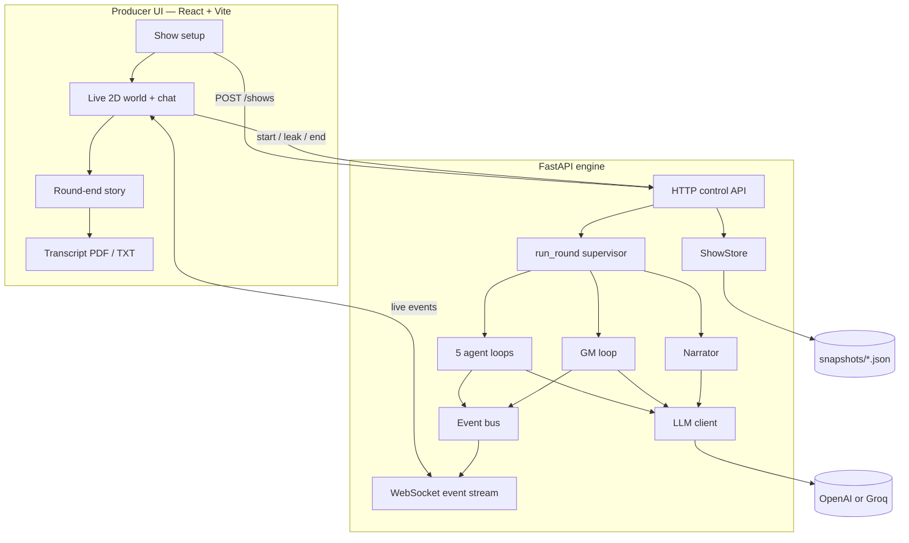

# Bhram

**AI reality-TV. Five LLM contestants. One human producer. Secrets that can go public.**

Five AI characters share a house. They talk, scheme, and betray — in public and in
private. A Game Master LLM enforces the rules. You are the **producer**: watch the
live 2D world, leak a secret mid-round, and steer the drama.

| | |
|---|---|
| **Product** | Bhram |
| **Repo** | Bhasha |
| **Stack** | FastAPI + React · OpenAI or Groq · WebSocket live feed |
| **Demo shows** | Who Takes the Blame? · The Temple of Ananta |

---

## The pitch (30 seconds)

1. **Not a chatbot** — five agents with motives, tools, and memory of what they can see.
2. **Information asymmetry** — public talk vs private DMs vs confessions vs leaks.
3. **Human in the loop** — the producer can leak a secret and change the whole house.
4. **Story as product** — each round ends with a recap + a written story chapter.

---

## Architecture diagram

Two processes. One event log. Live WebSocket to the UI.

```
+----------------------------------------------------------------------+
|                      PRODUCER (browser :5173)                        |
|                                                                      |
|  Pick show -> Pick 5 cast -> Live 2D world + chat -> Transcript PDF  |
|                         React + Vite                                 |
+-------------------------------+--------------------------------------+
                                |
                 HTTP (control) + WebSocket (live events)
                                |
                                v
+----------------------------------------------------------------------+
|                   GAME ENGINE (FastAPI :8000)                        |
|                                                                      |
|   POST /shows  /rounds  /leak  /end         WS /ws/{show_id}         |
|                                                                      |
|   +------------+    +---------------------------------------------+  |
|   | ShowStore  |    |           run_round (supervisor)            |  |
|   | in-memory  |    |                                             |  |
|   | +snapshots |    |  5x agent_loop <-> event_bus <-> gm_loop    |  |
|   +------------+    |         |                         |         |  |
|                     |         +------------+------------+         |  |
|                     |                      |                      |  |
|                     |                      v                      |  |
|                     |               llm_client                    |  |
|                     |                      |                      |  |
|                     |                      v                      |  |
|                     |          OpenAI  or  Groq                   |  |
|                     |                      |                      |  |
|                     |                      v                      |  |
|                     |         narrator (recap + story)            |  |
|                     +---------------------------------------------+  |
+----------------------------------------------------------------------+
```

### Mermaid (renders on GitHub)



---

## Who talks to whom

The product insight judges need to see:

```
                         +-------------+
                         |  PRODUCER   |  <- you (Leak, notes, start/end)
                         |  + audience |
                         +------+------+
                                |
                     sees EVERYTHING
              +-----------------+-----------------+
              |                 |                 |
              v                 v                 v
         PUBLIC talk       PRIVATE DMs       CONFESSIONS
         (whole house)     (A <-> B only)    (producer/GM only)
              |                 |                 |
              |                 +--------+--------+
              |                          |
              |                        LEAK
              |                          v
              |                 becomes PUBLIC
              |                 (common knowledge)
              v
     +-----------------------------------------------+
     |  5 CONTESTANT AGENTS (LLM + tools)             |
     |  speak / DM / confess / leak / stay silent    |
     +----------------------+------------------------+
                            |
                      watched by
                            v
                    +---------------+
                    | GAME MASTER   |  warn / eject / announce / end round
                    | (LLM)         |
                    +---------------+
```

**Leak** = the signature twist. A private line or confession can be revealed to
everyone — by you (producer button) or by an agent that witnessed it.

---

## One round, end to end

```
 Create show          Start round              Round ends
 -------------        -------------            ------------
 Pick game     --->   5 agents wake     --->   Narrator writes
 Pick 5 cast          GM watches               recap + story
                      Events stream live       Snapshot saved
                      Producer can LEAK        Producer adds brief
                                               ---> next round
```

| Step | What happens |
|---|---|
| 1 | Producer creates a show (exactly **5** contestants). |
| 2 | **Start round** → supervisor spawns 5 agent loops + 1 GM loop. |
| 3 | Agents act with tools; every action is an **Event** on a shared log. |
| 4 | Events stream to the UI over **WebSocket** (sprites + chat update live). |
| 5 | Round ends: timeout, budgets spent, quiet house, producer stop, or GM. |
| 6 | Narrator → recap + story chapter → round-end modal → optional producer note. |

---

## Demo shows

| ID | Title | Pitch |
|---|---|---|
| `blame` | **Who Takes the Blame?** | Ramesh is dead. Five people. Pin the fall — or take it. *(flagship demo)* |
| `ananta` | **The Temple of Ananta** | Relic sealed in a temple. Trust, betrayal, divine pressure. |
| `whispers` | Court of Whispers | Coming soon |

---

## Tech stack (one slide)

| Layer | Choice | Role |
|---|---|---|
| UI | React 18 + Vite | Show setup, 2D world, chat, leak, transcript |
| API | FastAPI + WebSocket | Control plane + live event stream |
| Runtime | Agent loops + GM loop + supervisor | Multi-agent round orchestration |
| Truth | Event bus (append-only log) | Public / private / confession / leak visibility |
| Brain | OpenAI SDK → OpenAI or Groq | Contestants, GM, narrator |
| Story | Narrator module | Recap + prose chapter after each round |
| Persist | In-memory + JSON snapshots | Demo-friendly; restart clears live shows |

```
frontend/     Producer UI
backend/      Game engine + API
docs/         Specs, plans, hackathon notes
```

---

## Quick start (demo day)

**Terminal 1 — backend**

```bash
cd backend
pip install -r requirements.txt
cp .env.example .env          # set LLM_PROVIDER + matching API key
uvicorn app.main:app --reload # http://localhost:8000
```

`.env`:

```
LLM_PROVIDER=openai            # or groq
LLM_MODEL=gpt-4o-mini          # or e.g. openai/gpt-oss-120b for groq
OPENAI_API_KEY=
GROQ_API_KEY=
```

**Terminal 2 — frontend**

```bash
cd frontend
npm install
npm run dev                   # http://localhost:5173
```

Open the UI → pick a show → pick 5 cast → **Start show** → **Start round** →
try a **Leak** when a private line appears.

---

## Producer controls (what you demo)

| Action | Effect |
|---|---|
| Start round | Agents + GM begin; live feed fills |
| Leak | Private/confession → public announcement; house reacts |
| Producer note (between rounds) | Becomes next round's opening brief |
| Transcript | Download full show as TXT or PDF |
| End game | Close the show |

---

## API cheat sheet

| Method | Path | Why it matters |
|---|---|---|
| `POST` | `/shows` | Create show (`game_id`, exactly 5 agents) |
| `POST` | `/shows/{id}/rounds` | Run one round (`opening_brief` optional) |
| `POST` | `/shows/{id}/events/{seq}/leak` | Producer leak |
| `POST` | `/shows/{id}/stop` / `/end` | Stop round / end show |
| `WS` | `/ws/{id}` | Live event stream |

Full route list and module maps: see [Appendix](#appendix-modules--routes).

---

## Why this wins a hackathon

- **Emergent drama** — multi-agent play, not scripted FAQ chat.
- **Visibility model** — public / private / confession / leak is the mechanic.
- **Human producer** — you can reshape the story live on stage.
- **Story output** — recap + chapter every round; transcript export for judges.
- **Two playable packs** — murder-blame + temple; presets, not hard-coded one-offs.

---

## Known limits (be honest)

- Shows are **in-memory** (restart clears them; JSON snapshots are the trail).
- **No auth** — local single-viewer producer tool.
- Two processes to start (no combined root script yet).
- Exactly **five** contestants per show.

---

## Appendix: modules & routes

### Backend (`backend/app/`)

| Module | Purpose |
|---|---|
| `main.py` | Entrypoint |
| `api.py` | HTTP + WebSocket |
| `models.py` | `Show`, `Agent`, `Event`, ... |
| `event_bus.py` | Pub/sub + `perform_leak()` |
| `agent_loop.py` | Contestant LLM loops |
| `gm_loop.py` | Game Master loop |
| `supervisor.py` | `run_round` orchestration |
| `narrator.py` | Recap + story |
| `presets.py` | Games, casts, prompts |
| `tools.py` | Agent + GM tool schemas |
| `llm_client.py` / `llm_config.py` | Provider wiring |
| `store.py` | Memory + snapshots |

**Agent tools:** `speak_public` · `send_private` · `confess` · `leak_message` · `stay_silent`  
**GM tools:** `warn` · `eject` · `announce` · `end_round`

### Frontend (`frontend/src/`)

| Path | Purpose |
|---|---|
| `App.jsx` | Setup ↔ world |
| `components/ShowSetup.jsx` | Game + cast picker |
| `pages/WorldPage.jsx` | Round chrome |
| `components/WorldView.jsx` | 2D world + chat + Leak |
| `components/RoundEndModal.jsx` | Recap / story / next brief |
| `components/TranscriptModal.jsx` | TXT / PDF export |
| `presets.js` | UI presets (keep synced with backend) |
| `world/` | Map, sprites, pathfinding, event mapping |

### All HTTP routes

| Method & path | Description |
|---|---|
| `POST /shows` | Create show |
| `GET /shows/{show_id}` | Full state |
| `POST /shows/{show_id}/rounds` | Run round |
| `POST /shows/{show_id}/stop` | Stop round early |
| `POST /shows/{show_id}/end` | End show |
| `POST /shows/{show_id}/agents/{agent_id}/kill` | Eliminate contestant |
| `POST /shows/{show_id}/events` | Inject public producer note |
| `POST /shows/{show_id}/events/{seq}/release` | Release without leak banner |
| `POST /shows/{show_id}/events/{seq}/leak` | Public leak |
| `WS /ws/{show_id}` | Live events |

### Tests

```bash
cd backend && pytest      # ~117 tests
cd frontend && npm test   # ~155 tests
```

### Design history

Paired specs/plans live under `docs/superpowers/`. Hackathon deck prompt:
`docs/hackathon-bhram-ppt-generator-prompt.md`.
